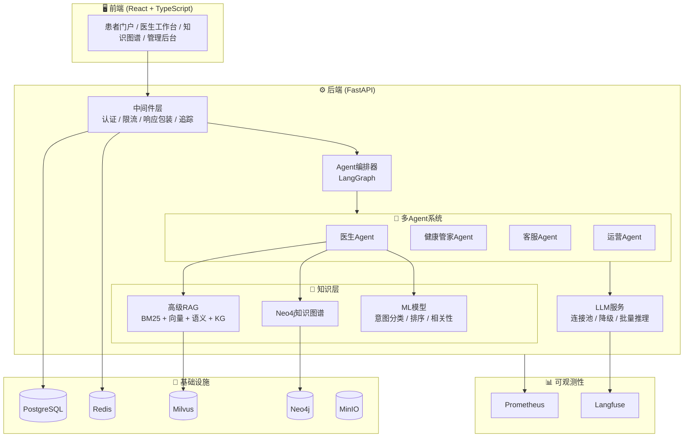

# 🏥 智能医疗管家平台

> **Intelligent Medical Consultation Platform** — An AI-powered healthcare assistant built with multi-agent orchestration, advanced RAG, and a knowledge graph.

<p align="center">
  <strong>以AI医生Agent为核心的新一代智能医疗咨询系统 · v3.1.0</strong><br>
  多Agent协同 · 高级RAG检索 · Neo4j知识图谱 · ML模型训练 · 全链路可观测性
</p>

<p align="center">
  <a href="https://github.com/zgsddzwj/intelligent_consultation/actions/workflows/ci.yml"></a>
  
  
  
  
  
  
  
  
  
</p>

---

## 📑 目录

- [✨ 项目亮点](#-项目亮点)
- [🏗️ 系统架构](#️-系统架构)
- [🎯 核心特性](#-核心特性)
- [🛠️ 技术栈](#️-技术栈)
- [🚀 快速开始](#-快速开始)
- [📁 项目结构](#-项目结构)
- [🧠 ML模型训练](#-ml模型训练)
- [🧪 测试体系](#-测试体系)
- [🔄 CI/CD 流水线](#-cicd-流水线)
- [📚 文档索引](#-文档索引)
- [🤝 参与贡献](#-参与贡献)
- [📈 Roadmap](#-roadmap)
- [⚖️ 合规声明](#️-合规声明)

---

## ✨ 项目亮点

**为什么值得关注这个项目？**

| 维度 | 说明 |
|------|------|
| 🤖 **生产级多Agent架构** | 基于 LangGraph 编排的 4 个专业 Agent（医生/健康管家/客服/运营），含意图分类、风险评估、状态缓存、工作流可视化 — 不是简单的单轮 chatbot |
| 🔍 **企业级RAG流水线** | 混合检索（BM25 + 向量 + 语义 + 知识图谱）→ BGE-Reranker 重排序 → ML 二次排序，完整的结构化文档解析与语义缓存 |
| 📊 **医疗知识图谱** | Neo4j 构建的专业医疗图谱，支持实体识别、关系推理、Cypher 查询缓存，前端力导向图可视化 |
| ⚡ **极致性能工程** | 多级缓存（L1 LRU + L2 Redis）、LLM 连接池 + 批量推理、数据库读写分离、布隆过滤器防穿透 |
| 👁️ **全链路可观测性** | Prometheus 指标 + 告警状态机（normal→pending→firing）+ Profiler（p50/p95/p99）+ Langfuse LLM 追踪 |
| 🔐 **安全合规设计** | JWT + RBAC、防重放攻击、审计日志脱敏、Fernet 数据加密、Prompt 安全审查（幻觉检测/有害内容过滤） |
| 🏗️ **云原生就绪** | Docker Compose 一键启动、完整 K8s 配置、GHCR 镜像自动构建、Trivy 漏洞扫描、K8s probes（health/ready/live） |
| 💅 **现代化前端** | React 18 + TypeScript + Vite，路由级懒加载、Zustand 精确订阅、暗色模式、响应式设计、骨架屏 |

---

## 🏗️ 系统架构



---

## 🎯 核心特性

| 特性 | 描述 |
|------|------|
| **🤖 多Agent协同** | 基于 LangGraph 编排的专业分工 Agent 系统，支持状态缓存、执行统计、工作流可视化 API |
| **🔍 高级RAG** | 混合检索（BM25+向量+语义+KG）、多路召回、BGE-Reranker 重排序、结构化文档解析、语义缓存 |
| **📊 医疗知识图谱** | 基于 Neo4j 构建的专业医疗图谱，支持实体识别、关系推理、意图分类与 LRU 查询缓存 |
| **🧠 ML模型训练** | 生产级 ML 流水线：SVM 意图分类、相关性评分、排序优化、集成学习重排，GridSearchCV 调优 |
| **👁️ 全链路监控** | Prometheus 指标 + 告警规则引擎 + 性能剖析器(p50/p95/p99) + Langfuse LLM 追踪 |
| **💅 现代化前端** | React 18 + TypeScript + Vite，代码分割懒加载、Zustand 状态分层、暗色模式、响应式设计 |
| **🔐 企业级安全** | JWT 认证、RBAC 权限、防重放攻击、审计日志、数据加密、请求签名验证 |
| **⚡ 极致性能** | 多级缓存(L1 LRU + L2 Redis)、连接池、批量推理、读写分离、动态连接池调整 |

---

## 🛠️ 技术栈

<details>
<summary><strong>📦 后端技术栈</strong></summary>

| 类别 | 技术 |
|------|------|
| **核心框架** | Python 3.11+, FastAPI, Uvicorn |
| **AI/LLM** | LangChain, LangGraph, Qwen (DashScope), DeepSeek |
| **RAG & 搜索** | Milvus (向量库), BM25, FlagEmbedding (Reranker), Jieba 分词 |
| **知识图谱** | Neo4j (含 APOC 插件) |
| **数据存储** | PostgreSQL 15 (业务), Redis 7 (缓存), MinIO (对象存储) |
| **文档处理** | PDFPlumber, MinerU, PaddleOCR |
| **机器学习** | Scikit-learn (SVM/随机森林/梯度提升), GridSearchCV 调优 |
| **监控告警** | Prometheus Client + 自定义告警规则引擎 + Profiler 性能剖析 |
| **安全** | JWT + 防重放攻击 + 审计日志 + HMAC 签名验证 |
| **工程化** | 统一响应包装、增强限流中间件、请求校验中间件、优雅关闭 |

</details>

<details>
<summary><strong>🎨 前端技术栈</strong></summary>

| 类别 | 技术 |
|------|------|
| **框架** | React 18 + TypeScript 5 + Vite 5 |
| **UI 组件** | Ant Design 5 |
| **状态管理** | Zustand 4 (subscribeWithSelector + devtools + persist) |
| **数据获取** | @tanstack/react-query 5 |
| **可视化** | react-force-graph-2d (知识图谱力导向图) |
| **路由** | React Router DOM 6 (路由级懒加载) |
| **设计系统** | CSS 变量、暗色模式、骨架屏、玻璃态效果、响应式布局 |

</details>

<details>
<summary><strong>☁️ 部署 & 基础设施</strong></summary>

| 类别 | 技术 |
|------|------|
| **容器化** | Docker + Docker Compose |
| **编排** | Kubernetes (完整 K8s 配置) |
| **CI/CD** | GitHub Actions (代码质量/测试/性能/构建/发布全流程) |
| **镜像仓库** | GHCR (GitHub Container Registry) |
| **安全扫描** | Trivy 漏洞扫描 |

</details>

---

## 🚀 快速开始

### 环境要求

- Docker & Docker Compose（推荐）
- 或 uv + Node.js 18+（本地开发）
  - 安装 uv: `curl -LsSf https://astral.sh/uv/install.sh | sh`

### 方式一：Docker 一键启动（推荐）

```bash
# 1. 克隆项目
git clone https://github.com/zgsddzwj/intelligent_consultation.git
cd intelligent_consultation

# 2. 配置环境变量
cp backend/.env.example backend/.env
# 编辑 backend/.env，至少配置 QWEN_API_KEY 或 DEEPSEEK_API_KEY

# 3. 启动全部服务
chmod +x scripts/start.sh && ./scripts/start.sh
# 或: docker-compose up -d

# 4. 初始化数据（首次运行）
cd backend
uv run python scripts/setup/init_all.py
uv run python scripts/ml/train_ml_models.py
```

### 方式二：本地开发

```bash
# 后端
cd backend
uv sync
cp .env.example .env  # 配置 API Key
uv run uvicorn app.main:app --reload --host 0.0.0.0 --port 8000

# 前端
cd frontend
npm install
npm run dev  # http://localhost:3000
```

### 最小可运行配置

| 场景 | 所需服务 | 说明 |
|------|----------|------|
| **仅问答** | 后端 + LLM API Key | 基础问答可用，无 RAG/知识图谱时会提示 |
| **完整能力** | + Neo4j + Milvus + Redis + PostgreSQL | RAG 检索、知识图谱、缓存、数据持久化全部启用 |

### 访问地址

| 服务 | 地址 |
|------|------|
| 前端问诊界面 | http://localhost:3000 |
| 医生工作台 | http://localhost:3000/doctor |
| 知识图谱可视化 | http://localhost:3000/knowledge-graph |
| 后端 API | http://localhost:8000 |
| API 文档 (Swagger) | http://localhost:8000/docs |
| 健康检查 | http://localhost:8000/health |
| Prometheus 指标 | http://localhost:8000/metrics |
| Neo4j 浏览器 | http://localhost:7474 |

---

## 📁 项目结构

```
intelligent_consultation/
├── backend/                          # 后端服务 (FastAPI)
│   ├── app/
│   │   ├── agents/                   # 多 Agent 系统 (LangGraph 编排)
│   │   │   ├── orchestrator.py       #   Agent 编排器 (状态缓存/指标/可视化)
│   │   │   ├── doctor_agent.py       #   医生 Agent
│   │   │   ├── health_manager_agent  #   健康管家 Agent
│   │   │   ├── customer_service_*    #   客服 Agent
│   │   │   ├── operations_agent.py   #   运营分析 Agent
│   │   │   └── tools/                #   Agent 工具集 (RAG/KG/诊断)
│   │   ├── api/v1/                   # API 路由 (咨询/Agent/知识/用户/图片)
│   │   │   └── middleware/           #   中间件 (认证/限流/响应包装/校验)
│   │   ├── common/                   # 公共模块 (异常/加密/追踪/RBAC)
│   │   ├── database/                 # 数据库 (PostgreSQL + 读写分离)
│   │   ├── infrastructure/           # 基础设施 (缓存/监控/限流/重试/仓储)
│   │   ├── knowledge/                # 知识层
│   │   │   ├── rag/                  #   高级 RAG 系统 (混合检索/重排序)
│   │   │   ├── graph/                #   Neo4j 知识图谱
│   │   │   └── ml/                   #   ML 模型 (意图分类/排序/相关性)
│   │   ├── models/                   # SQLAlchemy 数据模型
│   │   ├── services/                 # 业务服务层
│   │   │   ├── llm_service.py        #   LLM 服务 (连接池/降级/批量推理)
│   │   │   └── prompt_templates/     #   Prompt 模板管理
│   │   ├── utils/                    # 工具类 (安全/验证/日志)
│   │   └── main.py                   # 应用入口 (优雅启动/K8s probes)
│   ├── scripts/                      # 管理脚本（按用途分类）
│   │   ├── setup/                   #   系统初始化与验证
│   │   ├── data/                    #   数据获取与加载
│   │   ├── kg/                      #   知识图谱导入
│   │   ├── ml/                      #   ML 模型训练
│   │   └── maintenance/             #   运维与测试
│   ├── tests/                        # 测试套件 (单元/集成/性能)
│   ├── pyproject.toml               # Python 依赖与项目配置 (uv 管理)
│   └── uv.lock                      # uv 依赖锁文件
├── frontend/                         # 前端应用 (React + Vite)
│   └── src/
│       ├── pages/                    # 页面 (患者门户/医生工作台/知识图谱/管理)
│       ├── components/               # 通用组件 (表格/对话框/骨架屏/聊天)
│       ├── services/                 # API 服务层 (统一响应/SSE 流式)
│       ├── stores/                   # Zustand 状态管理
│       └── App.tsx                   # 应用布局 (代码分割/懒加载)
├── data/                             # 数据目录 (种子/外部/示例数据)
├── docs/                             # 详细文档 (架构/指南/规范)
├── k8s/                              # Kubernetes 部署配置
├── scripts/                          # 启动/运维 Shell 脚本
├── .github/workflows/                # CI/CD 工作流
├── docker-compose.yml                # Docker Compose 编排
└── README.md                         # 项目说明
```

---

## 🧠 ML模型训练

```bash
cd backend

# 训练所有模型
uv run python scripts/ml/train_ml_models.py

# 仅训练指定模型
uv run python scripts/ml/train_ml_models.py --model intent

# 使用自定义数据目录
uv run python scripts/ml/train_ml_models.py --data-dir ./data/training

# 输出详细报告
uv run python scripts/ml/train_ml_models.py --verbose
```

---

## 🧪 测试体系

```bash
cd backend

# 单元测试 + 覆盖率
uv run pytest tests/unit/ -v --cov=app --cov-report=html

# 集成测试
uv run pytest tests/integration/ -v

# 性能基准测试
uv run pytest tests/ -k benchmark -v

# 并行测试
uv run pytest tests/unit/ -n auto --timeout=60
```

---

## 🔄 CI/CD 流水线

GitHub Actions 全流程自动化 (`.github/workflows/ci.yml`)：

| Stage | 说明 |
|-------|------|
| **Code Quality** | black / isort / flake8 / mypy / bandit 安全扫描 |
| **Backend Test** | 单元测试 + 集成测试 + 覆盖率报告 |
| **Frontend Test** | ESLint + TypeScript 类型检查 + 构建验证 |
| **Performance** | 性能基准测试 |
| **Build Images** | Docker 镜像构建 + Trivy 漏洞扫描 |
| **Release** | 语义化版本发布 (SemVer) + 自动 Changelog |

---

## 📚 文档索引

| 文档 | 说明 |
|------|------|
| [快速开始指南](docs/QUICKSTART.md) | 快速启动和配置 |
| [部署文档](docs/DEPLOYMENT.md) | 部署方式和环境配置 |
| [架构文档](docs/ARCHITECTURE.md) | 系统架构设计 |
| [RAG 使用指南](docs/RAG_GUIDE.md) | RAG 系统使用指南 |
| [知识图谱指南](docs/KNOWLEDGE_GRAPH_GUIDE.md) | KG 操作与维护 |
| [优化指南](docs/OPTIMIZATION_GUIDE.md) | 系统性能优化 |
| [日志指南](docs/LOGGING.md) | 日志查看与排查 |
| [贡献指南](docs/CONTRIBUTING.md) | 参与项目贡献 |

---

## 🤝 参与贡献

欢迎任何形式的贡献！请阅读 [贡献指南](docs/CONTRIBUTING.md) 了解如何提交 Bug 报告、功能建议或 Pull Request。

```bash
# Fork 后开发流程
git clone https://github.com/<your-username>/intelligent_consultation.git
cd intelligent_consultation
git checkout -b feat/your-feature
# ... 开发 ...
git commit -m "feat: 你的功能描述"
git push origin feat/your-feature
# 在 GitHub 上创建 Pull Request
```

---

## 📈 Roadmap

### ✅ 已完成
- [x] 多 Agent 协同系统 (LangGraph) + 状态缓存 + 执行统计
- [x] 高级 RAG 检索管道 + 语义缓存
- [x] Neo4j 知识图谱 + LRU 查询缓存
- [x] ML 模型训练流水线 + 版本管理
- [x] 前端 UI 全面美化 + 代码分割懒加载
- [x] 多级缓存系统 (L1+L2)
- [x] LLM 服务连接池 + 智能降级 + 批量推理
- [x] 监控告警引擎 + 性能剖析器
- [x] 企业级安全体系 (防重放/审计/加密)
- [x] 完整 CI/CD 流水线 (代码质量/测试/扫描/发布)
- [x] 知识图谱实时更新机制（事件驱动 + CRUD API + 审计日志）
- [x] 多模态诊断能力增强（图像分类 + 结构化报告 + KG 关联）
- [x] Kubernetes 资源配置完善（NetworkPolicy + ServiceMonitor + HPA/PDB + ResourceQuota + PriorityClass）

### 📋 规划中
- [ ] 移动端 App (React Native / Flutter)
- [ ] 更多垂类医疗模型支持
- [ ] 国际化 (i18n) 多语言支持
- [ ] 联邦学习隐私保护方案

---

## ⚖️ 合规声明

> ⚠️ **本系统仅提供医疗信息参考，不替代医生诊断和治疗，具体医疗方案请遵医嘱。**

---

## 📄 许可证

[MIT License](LICENSE) — Copyright © 2025-2026 WangJian

---

<div align="center">

**⭐ 如果这个项目对你有帮助，请给一个 Star！⭐**

Made with ❤️ by 智能医疗管家团队

</div>
