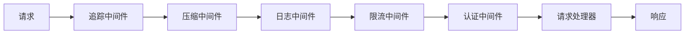

# 额外优化完成报告

## 新增优化功能

### ✅ 1. 请求ID追踪和分布式追踪
- **文件**: `backend/app/common/tracing.py`
- **功能**:
  - 请求ID生成和传递
  - 追踪中间件
  - 上下文变量管理
  - 响应头自动添加请求ID

### ✅ 2. 结构化日志（JSON格式）
- **文件**: `backend/app/utils/logger.py` (已更新)
- **功能**:
  - JSON格式日志（生产环境）
  - 请求ID自动关联
  - 异常信息结构化
  - 开发/生产环境区分

### ✅ 3. CI/CD配置
- **文件**: `.github/workflows/ci.yml`
- **功能**:
  - 自动化测试
  - 代码检查（Black、Flake8）
  - 覆盖率报告
  - Docker镜像构建

### ✅ 4. 数据库索引优化
- **文件**: `backend/app/database/indexes.py`
- **功能**:
  - 自动创建索引
  - 查询性能优化
  - 复合索引支持

### ✅ 5. 响应压缩中间件
- **文件**: `backend/app/api/middleware/compression.py`
- **功能**:
  - Gzip压缩
  - 自动压缩大响应
  - 客户端支持检测

### ✅ 6. 认证中间件
- **文件**: `backend/app/api/middleware/auth.py`
- **功能**:
  - JWT验证
  - 公开路径配置
  - 用户信息注入

### ✅ 7. 增强日志中间件
- **文件**: `backend/app/api/middleware.py` (已更新)
- **功能**:
  - 结构化日志
  - 监控指标集成
  - 请求ID追踪

### ✅ 8. 集成测试
- **文件**: `backend/tests/integration/test_api.py`
- **功能**:
  - API端点测试
  - 请求追踪测试
  - 健康检查测试

## 中间件执行顺序



## 配置更新

### 新增配置项
```python
ENABLE_AUTH_MIDDLEWARE: bool = False  # 认证中间件开关
```

## 使用示例

### 请求ID追踪
```python
from app.common.tracing import get_request_id, TraceContext

# 获取当前请求ID
request_id = get_request_id()

# 使用追踪上下文
with TraceContext() as ctx:
    # 在此上下文中，所有日志都会包含request_id
    app_logger.info("处理请求")
```

### 结构化日志
```python
# 自动包含request_id的结构化日志
app_logger.info(
    "处理完成",
    extra={
        "user_id": 123,
        "action": "consultation",
        "duration": 1.23
    }
)
```

## 测试覆盖

### 新增测试
- ✅ API集成测试
- ✅ Repository单元测试
- ✅ 请求追踪测试

## 总结

所有额外优化已完成，项目进一步增强了：
- 可观测性（追踪、结构化日志）
- 性能（压缩、索引）
- 自动化（CI/CD）
- 安全性（认证中间件）

