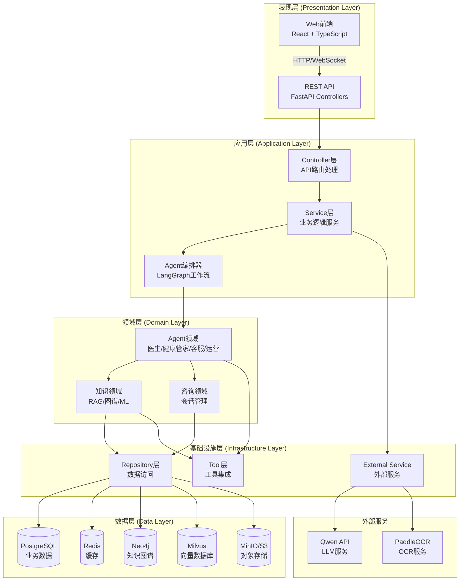
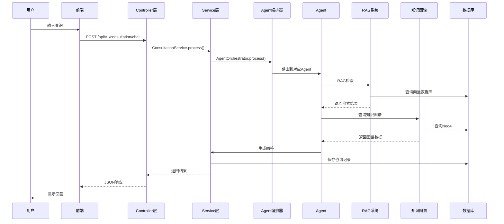
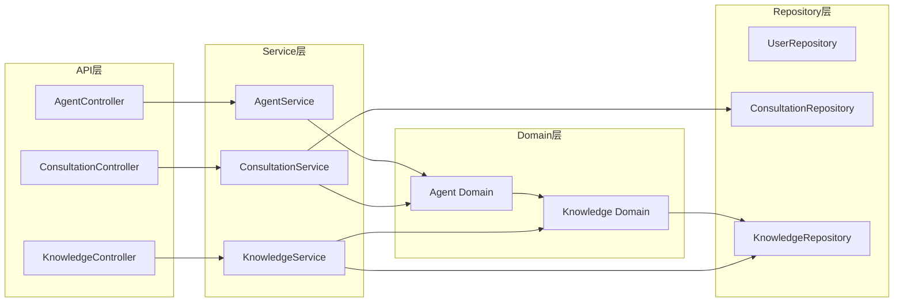
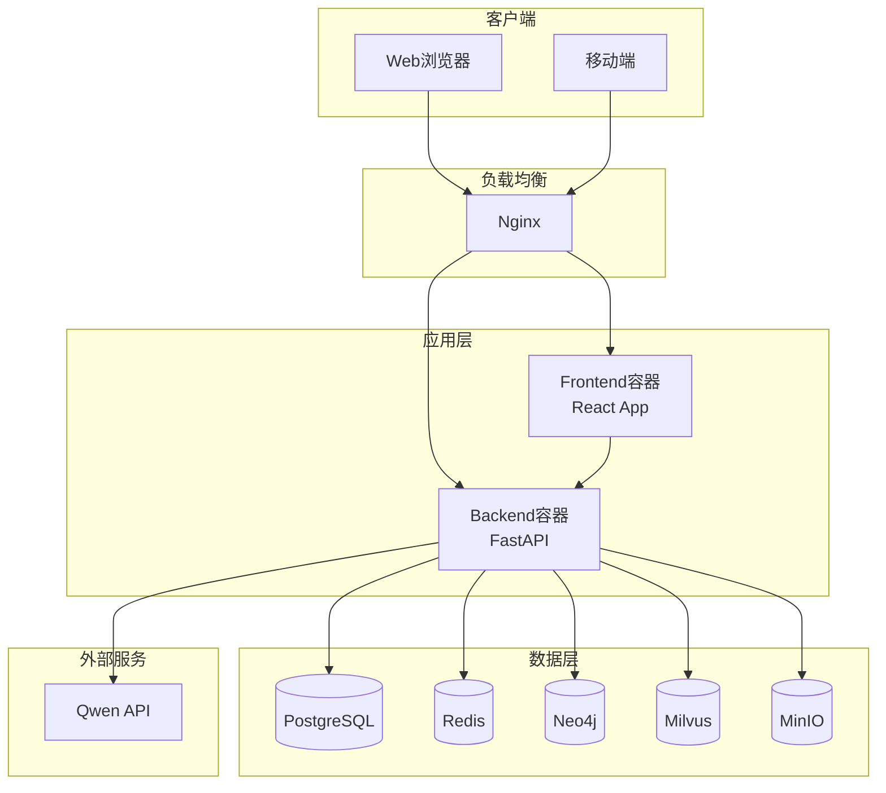
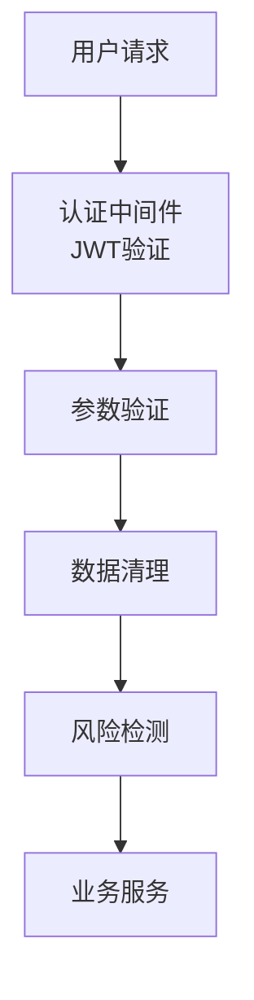

# 智能医疗管家平台 - 系统架构文档

## 架构概览

本系统采用分层架构设计，遵循工业级标准命名规范，包含以下层次：

- **Presentation Layer (表现层)**: 前端UI和API接口
- **Application Layer (应用层)**: 业务逻辑和Agent编排
- **Domain Layer (领域层)**: 核心业务模型和规则
- **Infrastructure Layer (基础设施层)**: 数据存储、外部服务、工具

## 系统架构图



## 分层架构详解

### 1. 表现层 (Presentation Layer)

**职责**: 用户交互和API接口

#### 1.1 Web前端
- **位置**: `frontend/src/`
- **技术栈**: React 18 + TypeScript + Vite
- **组件**:
  - Pages: 页面组件
  - Components: 可复用组件
  - Services: API客户端
  - Stores: 状态管理

#### 1.2 REST API
- **位置**: `backend/app/api/v1/`
- **技术栈**: FastAPI
- **模块**:
  - `consultation.py`: 咨询API控制器
  - `agents.py`: Agent管理API控制器
  - `knowledge.py`: 知识库API控制器
  - `users.py`: 用户管理API控制器
  - `image_analysis.py`: 图片分析API控制器

### 2. 应用层 (Application Layer)

**职责**: 业务逻辑编排和流程控制

#### 2.1 Controller层
- **位置**: `backend/app/api/v1/`
- **职责**:
  - 请求参数验证
  - 调用Service层
  - 响应格式化
  - 异常处理

#### 2.2 Service层
- **位置**: `backend/app/services/`
- **职责**:
  - 业务逻辑实现
  - 事务管理
  - 服务编排
- **服务**:
  - `LLMService`: LLM服务
  - `MilvusService`: 向量数据库服务
  - `RedisService`: 缓存服务
  - `LoggingService`: 日志服务

#### 2.3 Agent编排器
- **位置**: `backend/app/agents/orchestrator.py`
- **职责**:
  - 多Agent工作流编排
  - 意图识别和路由
  - 风险评估
  - Agent协同

### 3. 领域层 (Domain Layer)

**职责**: 核心业务模型和规则

#### 3.1 Agent领域
- **位置**: `backend/app/agents/`
- **实体**:
  - `DoctorAgent`: 医生Agent
  - `HealthManagerAgent`: 健康管家Agent
  - `CustomerServiceAgent`: 客服Agent
  - `OperationsAgent`: 运营Agent
- **工具**: `backend/app/agents/tools/`
  - `RAGTool`: RAG检索工具
  - `KnowledgeGraphTool`: 知识图谱工具
  - `DiagnosisTool`: 诊断辅助工具
  - `MedicalQueryTool`: 医疗查询工具

#### 3.2 知识领域
- **位置**: `backend/app/knowledge/`
- **模块**:
  - **RAG系统** (`rag/`):
    - `AdvancedRAG`: 高级RAG主类
    - `MultiRetrieval`: 多路召回
    - `Reranker`: 重排序
    - `DocumentProcessor`: 文档处理
  - **知识图谱** (`graph/`):
    - `Neo4jClient`: Neo4j客户端
    - `KnowledgeGraphBuilder`: 图谱构建器
    - `CypherQueries`: 查询模板
  - **机器学习** (`ml/`):
    - `IntentClassifier`: 意图分类
    - `RelevanceScorer`: 相关性评分
    - `QueryUnderstanding`: 查询理解
    - `RankingOptimizer`: 排序优化

#### 3.3 咨询领域
- **位置**: `backend/app/models/consultation.py`
- **实体**: Consultation模型

### 4. 基础设施层 (Infrastructure Layer)

**职责**: 数据访问、外部服务、工具集成

#### 4.1 Repository层
- **位置**: `backend/app/database/`
- **职责**:
  - 数据访问抽象
  - 数据库会话管理
  - 数据模型定义
- **组件**:
  - `SessionManager`: 会话管理
  - `BaseModel`: 数据模型基类
  - `init_db.py`: 数据库初始化

#### 4.2 External Service层
- **位置**: `backend/app/services/`
- **职责**:
  - 外部API调用
  - 第三方服务集成
- **服务**:
  - `LLMService`: Qwen API集成
  - `MilvusService`: Milvus向量数据库
  - `RedisService`: Redis缓存
  - `ObjectStorageService`: 对象存储服务 (MinIO/S3/OSS)

#### 4.3 Tool层
- **位置**: `backend/app/agents/tools/`
- **职责**:
  - 工具封装
  - 工具调用接口
  - MCP协议支持

### 5. 数据层 (Data Layer)

**职责**: 数据持久化

- **PostgreSQL**: 业务数据（用户、咨询、文档元数据等）
- **Redis**: 缓存数据
- **Neo4j**: 知识图谱数据
- **Milvus**: 向量数据
- **Object Storage**: 非结构化文档文件 (PDF/图片等)

## 数据流图



## 模块依赖关系



## 对象存储与文档管理

系统实现了基于对象存储的企业级文档管理架构，支持 MinIO、AWS S3 和阿里云 OSS。

### 存储架构
```
用户上传文档
    ↓
[API层] 验证和接收
    ↓
[对象存储服务] 上传到MinIO/S3/OSS
    ├─ 文档文件 → 对象存储（MinIO/S3/OSS）
    ├─ 文档元数据 → PostgreSQL数据库
    └─ 向量数据 → Milvus向量数据库
```

### 核心组件
- **ObjectStorageService**: 封装 MinIO/S3/OSS 客户端，提供统一的文件操作接口（上传、下载、删除、预签名URL）。
- **配置**: 通过 `.env` 配置 `OBJECT_STORAGE_TYPE` (minio/s3/oss) 及相关凭证。
- **数据迁移**: 提供 `migrate_to_object_storage.py` 脚本，支持将本地文件迁移至对象存储。

## 命名规范映射

### 当前命名 → 工业级命名

| 当前命名 | 工业级命名 | 说明 |
|---------|-----------|------|
| `api/v1/` | `controllers/` 或 `api/controllers/` | API控制器层 |
| `services/` | `services/` | 业务服务层（保持不变） |
| `agents/` | `domain/agents/` | Agent领域模型 |
| `knowledge/` | `domain/knowledge/` | 知识领域模型 |
| `models/` | `domain/models/` 或 `entities/` | 领域实体 |
| `database/` | `repositories/` 或 `infrastructure/database/` | 数据访问层 |
| `utils/` | `common/` 或 `shared/` | 通用工具 |

## 推荐的目录结构重构

```
backend/app/
├── api/                    # API层
│   ├── controllers/        # 控制器（原api/v1/）
│   │   ├── consultation_controller.py
│   │   ├── agent_controller.py
│   │   ├── knowledge_controller.py
│   │   └── user_controller.py
│   ├── middleware/         # 中间件
│   └── dto/                # 数据传输对象
│
├── application/            # 应用层
│   ├── services/           # 应用服务
│   │   ├── consultation_service.py
│   │   ├── agent_service.py
│   │   └── knowledge_service.py
│   └── orchestrators/      # 编排器
│       └── agent_orchestrator.py
│
├── domain/                 # 领域层
│   ├── agents/             # Agent领域
│   │   ├── doctor_agent.py
│   │   ├── health_manager_agent.py
│   │   └── tools/
│   ├── knowledge/          # 知识领域
│   │   ├── rag/
│   │   ├── graph/
│   │   └── ml/
│   ├── consultation/       # 咨询领域
│   └── entities/           # 领域实体（原models/）
│
├── infrastructure/         # 基础设施层
│   ├── repositories/       # 数据访问（原database/）
│   │   ├── user_repository.py
│   │   ├── consultation_repository.py
│   │   └── knowledge_repository.py
│   ├── external/           # 外部服务
│   │   ├── llm_client.py
│   │   ├── milvus_client.py
│   │   ├── neo4j_client.py
│   │   └── object_storage_client.py
│   └── database/           # 数据库配置
│
├── common/                 # 通用层（原utils/）
│   ├── logger.py
│   ├── security.py
│   └── validators.py
│
└── config.py               # 配置管理
```

## 核心组件说明

### Controller层 (API Controllers)
- **职责**: 处理HTTP请求，参数验证，调用Service
- **命名**: `*_controller.py`
- **示例**: `ConsultationController`, `KnowledgeController`

### Service层 (Application Services)
- **职责**: 业务逻辑实现，事务管理
- **命名**: `*_service.py`
- **示例**: `ConsultationService`, `KnowledgeService`

### Repository层 (Data Access)
- **职责**: 数据访问抽象，CRUD操作
- **命名**: `*_repository.py`
- **示例**: `UserRepository`, `ConsultationRepository`

### Domain层 (Domain Models)
- **职责**: 核心业务逻辑，领域规则
- **命名**: 领域实体和值对象
- **示例**: `Agent`, `Consultation`, `KnowledgeDocument`

### Infrastructure层
- **职责**: 技术实现，外部服务集成
- **命名**: `*_client.py`, `*_adapter.py`
- **示例**: `LLMClient`, `MilvusClient`, `Neo4jClient`

## 技术栈映射

| 层次 | 技术栈 |
|-----|--------|
| 表现层 | React 18, TypeScript, Ant Design |
| API层 | FastAPI, Pydantic |
| 应用层 | Python, LangGraph |
| 领域层 | Python, Domain Models |
| 基础设施层 | SQLAlchemy, Redis, Neo4j Driver, Milvus Client, MinIO Client |
| 数据层 | PostgreSQL, Redis, Neo4j, Milvus, MinIO/S3 |

## 部署架构



## 关键设计模式

1. **分层架构**: 清晰的层次划分，职责分离
2. **依赖注入**: 通过依赖注入管理组件依赖
3. **仓储模式**: Repository模式抽象数据访问
4. **服务层模式**: Service层封装业务逻辑
5. **策略模式**: 多种检索策略（向量、BM25、语义、图谱）
6. **工厂模式**: Agent工厂创建不同类型的Agent
7. **观察者模式**: 日志和监控系统
8. **适配器模式**: 封装不同的对象存储后端（S3/OSS/MinIO）

## 数据流向

### 查询流程
```
用户查询 
  → Controller (参数验证)
  → Service (业务逻辑)
  → Orchestrator (工作流编排)
  → Agent (领域逻辑)
  → RAG/KG (知识检索)
  → Repository (数据访问)
  → Database (数据存储)
  → 返回结果
```

### 数据存储流程
```
文档上传
  → Controller
  → Service (ObjectStorageService)
  → ObjectStorage (文件存储)
  → DocumentProcessor (文档处理)
  → Embedder (向量化)
  → Repository
  → Milvus (向量存储)
  → PostgreSQL (元数据存储)
```

## 扩展性设计

1. **水平扩展**: 无状态设计，支持多实例部署
2. **垂直扩展**: 模块化设计，可按需扩展功能
3. **插件化**: Agent工具采用插件化设计
4. **配置化**: 通过配置文件控制功能开关

## 安全架构



## 监控和日志

- **日志**: 结构化日志，分级记录
- **监控**: Agent执行监控，API性能监控
- **追踪**: 请求追踪，来源追溯
- **审计**: 操作审计，数据变更记录
