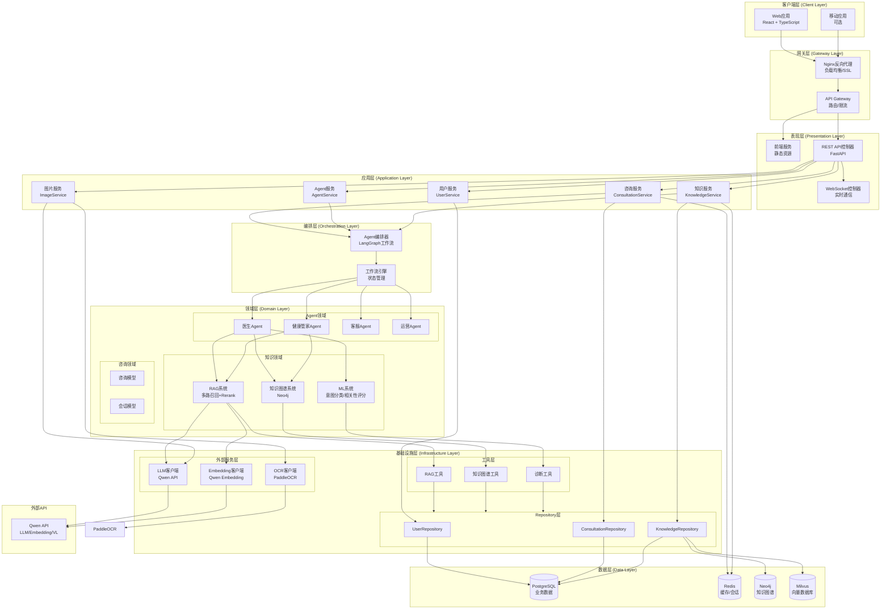
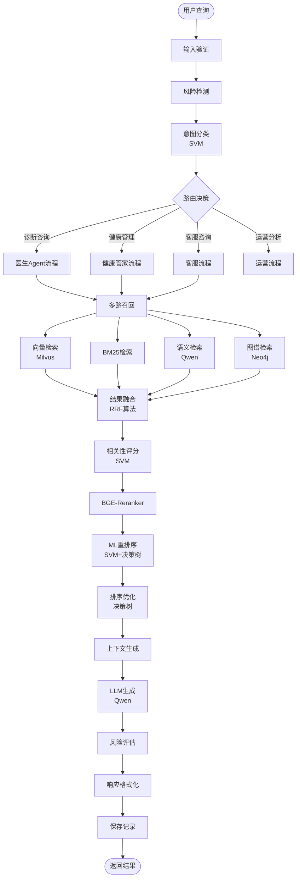
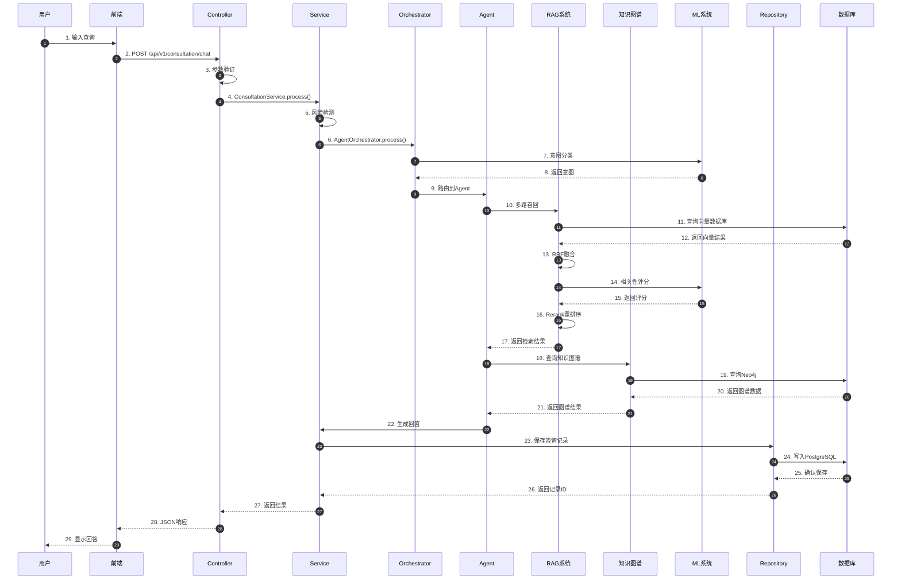
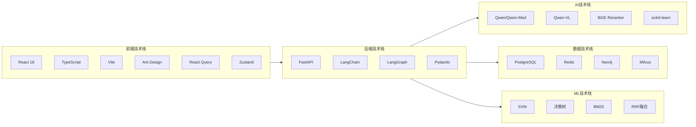
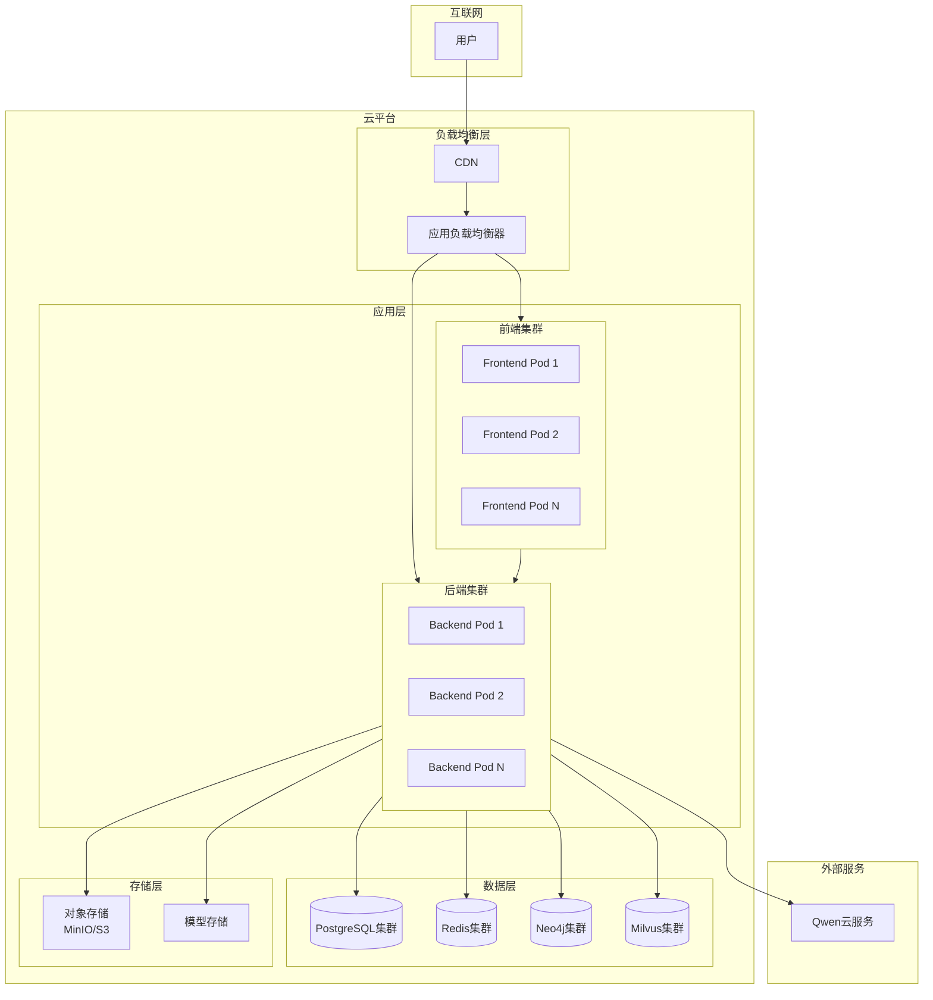
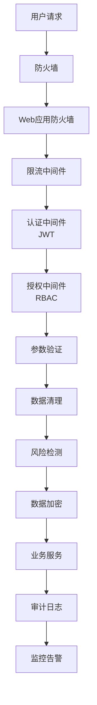
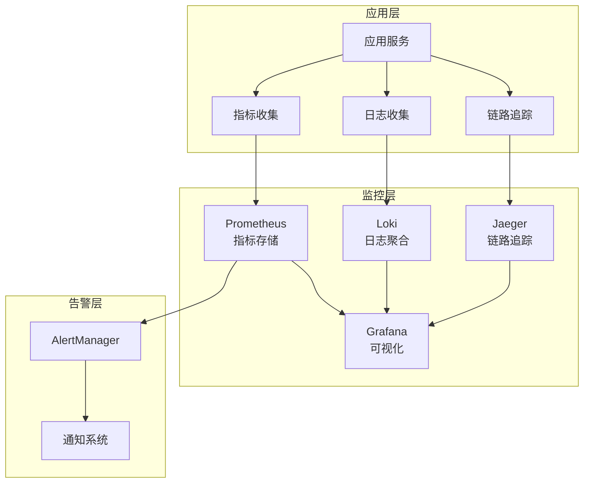

# 系统架构图 - 详细版

## 完整系统架构

```mermaid
graph TB
    subgraph ClientLayer["客户端层 (Client Layer)"]
        WebApp[Web应用<br/>React + TypeScript]
        MobileApp[移动应用<br/>可选]
    end
    
    subgraph GatewayLayer["网关层 (Gateway Layer)"]
        Nginx[Nginx反向代理<br/>负载均衡/SSL]
        API[API Gateway<br/>路由/限流]
    end
    
    subgraph PresentationLayer["表现层 (Presentation Layer)"]
        FrontendService[前端服务<br/>静态资源]
        RESTController[REST API控制器<br/>FastAPI]
        WebSocketController[WebSocket控制器<br/>实时通信]
    end
    
    subgraph ApplicationLayer["应用层 (Application Layer)"]
        ConsultationService[咨询服务<br/>ConsultationService]
        AgentService[Agent服务<br/>AgentService]
        KnowledgeService[知识服务<br/>KnowledgeService]
        UserService[用户服务<br/>UserService]
        ImageService[图片服务<br/>ImageService]
    end
    
    subgraph OrchestrationLayer["编排层 (Orchestration Layer)"]
        AgentOrchestrator[Agent编排器<br/>LangGraph工作流]
        WorkflowEngine[工作流引擎<br/>状态管理]
    end
    
    subgraph DomainLayer["领域层 (Domain Layer)"]
        subgraph AgentDomain["Agent领域"]
            DoctorAgent[医生Agent]
            HealthAgent[健康管家Agent]
            ServiceAgent[客服Agent]
            OpsAgent[运营Agent]
        end
        
        subgraph KnowledgeDomain["知识领域"]
            RAGSystem[RAG系统<br/>多路召回+Rerank]
            GraphSystem[知识图谱系统<br/>Neo4j]
            MLSystem[ML系统<br/>意图分类/相关性评分]
        end
        
        subgraph ConsultationDomain["咨询领域"]
            ConsultationModel[咨询模型]
            SessionModel[会话模型]
        end
    end
    
    subgraph InfrastructureLayer["基础设施层 (Infrastructure Layer)"]
        subgraph RepositoryLayer["Repository层"]
            UserRepo[UserRepository]
            ConsultationRepo[ConsultationRepository]
            KnowledgeRepo[KnowledgeRepository]
        end
        
        subgraph ExternalServiceLayer["外部服务层"]
            LLMClient[LLM客户端<br/>Qwen API]
            OCRClient[OCR客户端<br/>PaddleOCR]
            EmbeddingClient[Embedding客户端<br/>Qwen Embedding]
        end
        
        subgraph ToolLayer["工具层"]
            RAGTool[RAG工具]
            KGTool[知识图谱工具]
            DiagnosisTool[诊断工具]
        end
    end
    
    subgraph DataLayer["数据层 (Data Layer)"]
        PostgreSQL[(PostgreSQL<br/>业务数据)]
        Redis[(Redis<br/>缓存/会话)]
        Neo4j[(Neo4j<br/>知识图谱)]
        Milvus[(Milvus<br/>向量数据库)]
    end
    
    subgraph ExternalAPIs["外部API"]
        QwenAPI[Qwen API<br/>LLM/Embedding/VL]
    end
    
    WebApp --> Nginx
    MobileApp --> Nginx
    Nginx --> API
    API --> FrontendService
    API --> RESTController
    RESTController --> WebSocketController
    
    RESTController --> ConsultationService
    RESTController --> AgentService
    RESTController --> KnowledgeService
    RESTController --> UserService
    RESTController --> ImageService
    
    ConsultationService --> AgentOrchestrator
    AgentService --> AgentOrchestrator
    KnowledgeService --> AgentOrchestrator
    
    AgentOrchestrator --> WorkflowEngine
    WorkflowEngine --> DoctorAgent
    WorkflowEngine --> HealthAgent
    WorkflowEngine --> ServiceAgent
    WorkflowEngine --> OpsAgent
    
    DoctorAgent --> RAGSystem
    DoctorAgent --> GraphSystem
    DoctorAgent --> MLSystem
    HealthAgent --> RAGSystem
    HealthAgent --> GraphSystem
    
    RAGSystem --> RAGTool
    GraphSystem --> KGTool
    MLSystem --> DiagnosisTool
    
    RAGTool --> RepositoryLayer
    KGTool --> RepositoryLayer
    DiagnosisTool --> RepositoryLayer
    
    ConsultationService --> ConsultationRepo
    UserService --> UserRepo
    KnowledgeService --> KnowledgeRepo
    
    UserRepo --> PostgreSQL
    ConsultationRepo --> PostgreSQL
    KnowledgeRepo --> PostgreSQL
    KnowledgeRepo --> Neo4j
    KnowledgeRepo --> Milvus
    
    ConsultationService --> Redis
    KnowledgeService --> Redis
    
    RAGSystem --> LLMClient
    RAGSystem --> EmbeddingClient
    ImageService --> OCRClient
    ImageService --> LLMClient
    
    LLMClient --> QwenAPI
    EmbeddingClient --> QwenAPI
    OCRClient --> PaddleOCR
```

## 数据流架构

```mermaid
flowchart TD
    Start([用户查询]) --> InputValidation[输入验证]
    InputValidation --> RiskDetection[风险检测]
    RiskDetection --> IntentClassification[意图分类<br/>SVM]
    
    IntentClassification --> RouteDecision{路由决策}
    
    RouteDecision -->|诊断咨询| DoctorFlow[医生Agent流程]
    RouteDecision -->|健康管理| HealthFlow[健康管家流程]
    RouteDecision -->|客服咨询| ServiceFlow[客服流程]
    RouteDecision -->|运营分析| OpsFlow[运营流程]
    
    DoctorFlow --> MultiRetrieval[多路召回]
    HealthFlow --> MultiRetrieval
    ServiceFlow --> MultiRetrieval
    
    MultiRetrieval --> VectorRetrieval[向量检索<br/>Milvus]
    MultiRetrieval --> BM25Retrieval[BM25检索]
    MultiRetrieval --> SemanticRetrieval[语义检索<br/>Qwen]
    MultiRetrieval --> KGRetrieval[图谱检索<br/>Neo4j]
    
    VectorRetrieval --> RRF[结果融合<br/>RRF算法]
    BM25Retrieval --> RRF
    SemanticRetrieval --> RRF
    KGRetrieval --> RRF
    
    RRF --> RelevanceScoring[相关性评分<br/>SVM]
    RelevanceScoring --> Rerank[BGE-Reranker]
    Rerank --> MLRerank[ML重排序<br/>SVM+决策树]
    MLRerank --> RankingOptimization[排序优化<br/>决策树]
    
    RankingOptimization --> ContextGeneration[上下文生成]
    ContextGeneration --> LLMGeneration[LLM生成<br/>Qwen]
    LLMGeneration --> RiskAssessment[风险评估]
    RiskAssessment --> ResponseFormat[响应格式化]
    ResponseFormat --> SaveRecord[保存记录]
    SaveRecord --> End([返回结果])
```

## 组件交互图

```mermaid
sequenceDiagram
    autonumber
    participant User as 用户
    participant Frontend as 前端
    participant Controller as Controller
    participant Service as Service
    participant Orchestrator as Orchestrator
    participant Agent as Agent
    participant RAG as RAG系统
    participant KG as 知识图谱
    participant ML as ML系统
    participant Repo as Repository
    participant DB as 数据库
    
    User->>Frontend: 1. 输入查询
    Frontend->>Controller: 2. POST /api/v1/consultation/chat
    Controller->>Controller: 3. 参数验证
    Controller->>Service: 4. ConsultationService.process()
    Service->>Service: 5. 风险检测
    Service->>Orchestrator: 6. AgentOrchestrator.process()
    Orchestrator->>ML: 7. 意图分类
    ML-->>Orchestrator: 8. 返回意图
    Orchestrator->>Agent: 9. 路由到Agent
    Agent->>RAG: 10. 多路召回
    RAG->>DB: 11. 查询向量数据库
    DB-->>RAG: 12. 返回向量结果
    RAG->>RAG: 13. RRF融合
    RAG->>ML: 14. 相关性评分
    ML-->>RAG: 15. 返回评分
    RAG->>RAG: 16. Rerank重排序
    RAG-->>Agent: 17. 返回检索结果
    Agent->>KG: 18. 查询知识图谱
    KG->>DB: 19. 查询Neo4j
    DB-->>KG: 20. 返回图谱数据
    KG-->>Agent: 21. 返回图谱结果
    Agent->>Service: 22. 生成回答
    Service->>Repo: 23. 保存咨询记录
    Repo->>DB: 24. 写入PostgreSQL
    DB-->>Repo: 25. 确认保存
    Repo-->>Service: 26. 返回记录ID
    Service-->>Controller: 27. 返回结果
    Controller-->>Frontend: 28. JSON响应
    Frontend-->>User: 29. 显示回答
```

## 技术栈架构

```mermaid
graph LR
    subgraph FrontendTech["前端技术栈"]
        React[React 18]
        TS[TypeScript]
        Vite[Vite]
        AntD[Ant Design]
        ReactQuery[React Query]
        Zustand[Zustand]
    end
    
    subgraph BackendTech["后端技术栈"]
        FastAPI[FastAPI]
        LangChain[LangChain]
        LangGraph[LangGraph]
        Pydantic[Pydantic]
    end
    
    subgraph AITech["AI技术栈"]
        Qwen[Qwen/Qwen-Med]
        QwenVL[Qwen-VL]
        BGE[BGE-Reranker]
        Sklearn[scikit-learn]
    end
    
    subgraph DataTech["数据技术栈"]
        PostgreSQL[PostgreSQL]
        Redis[Redis]
        Neo4j[Neo4j]
        Milvus[Milvus]
    end
    
    subgraph MLTech["ML技术栈"]
        SVM[SVM]
        DTree[决策树]
        BM25[BM25]
        RRF[RRF融合]
    end
    
    FrontendTech --> BackendTech
    BackendTech --> AITech
    BackendTech --> DataTech
    BackendTech --> MLTech
```

## 部署架构

```mermaid
graph TB
    subgraph Internet["互联网"]
        Users[用户]
    end
    
    subgraph Cloud["云平台"]
        subgraph LB["负载均衡层"]
            ALB[应用负载均衡器]
            CDN[CDN]
        end
        
        subgraph App["应用层"]
            subgraph FrontendCluster["前端集群"]
                Frontend1[Frontend Pod 1]
                Frontend2[Frontend Pod 2]
                FrontendN[Frontend Pod N]
            end
            
            subgraph BackendCluster["后端集群"]
                Backend1[Backend Pod 1]
                Backend2[Backend Pod 2]
                BackendN[Backend Pod N]
            end
        end
        
        subgraph Data["数据层"]
            PGCluster[(PostgreSQL集群)]
            RedisCluster[(Redis集群)]
            Neo4jCluster[(Neo4j集群)]
            MilvusCluster[(Milvus集群)]
        end
        
        subgraph Storage["存储层"]
            ObjectStorage[对象存储<br/>MinIO/S3]
            ModelStorage[模型存储]
        end
    end
    
    subgraph External["外部服务"]
        QwenCloud[Qwen云服务]
    end
    
    Users --> CDN
    CDN --> ALB
    ALB --> FrontendCluster
    ALB --> BackendCluster
    
    FrontendCluster --> BackendCluster
    BackendCluster --> PGCluster
    BackendCluster --> RedisCluster
    BackendCluster --> Neo4jCluster
    BackendCluster --> MilvusCluster
    BackendCluster --> ObjectStorage
    BackendCluster --> ModelStorage
    BackendCluster --> QwenCloud
```

## 安全架构

```mermaid
graph TB
    Request[用户请求] --> Firewall[防火墙]
    Firewall --> WAF[Web应用防火墙]
    WAF --> RateLimit[限流中间件]
    RateLimit --> Auth[认证中间件<br/>JWT]
    Auth --> Authorization[授权中间件<br/>RBAC]
    Authorization --> Validation[参数验证]
    Validation --> Sanitization[数据清理]
    Sanitization --> RiskCheck[风险检测]
    RiskCheck --> Encryption[数据加密]
    Encryption --> Service[业务服务]
    Service --> Audit[审计日志]
    Audit --> Monitor[监控告警]
```

## 监控架构

```mermaid
graph TB
    subgraph Application["应用层"]
        App[应用服务]
        Metrics[指标收集]
        Logs[日志收集]
        Traces[链路追踪]
    end
    
    subgraph Monitoring["监控层"]
        Prometheus[Prometheus<br/>指标存储]
        Loki[Loki<br/>日志聚合]
        Jaeger[Jaeger<br/>链路追踪]
        Grafana[Grafana<br/>可视化]
    end
    
    subgraph Alerting["告警层"]
        AlertManager[AlertManager]
        Notification[通知系统]
    end
    
    App --> Metrics
    App --> Logs
    App --> Traces
    
    Metrics --> Prometheus
    Logs --> Loki
    Traces --> Jaeger
    
    Prometheus --> Grafana
    Loki --> Grafana
    Jaeger --> Grafana
    
    Prometheus --> AlertManager
    AlertManager --> Notification
```

