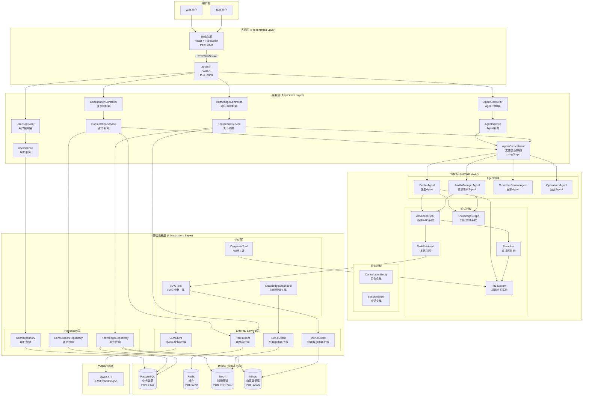
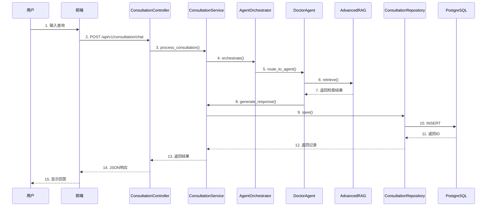
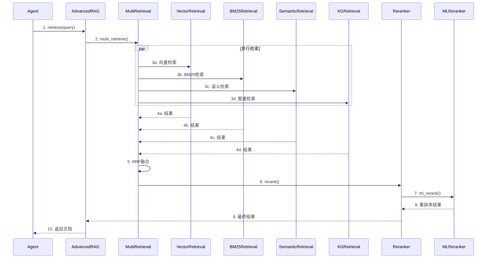
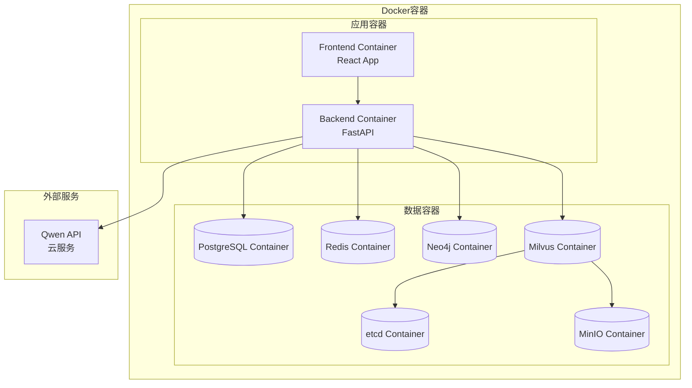

# 智能医疗管家平台 - 架构总览

## 系统架构全景图

## 分层架构详解

### 1. 表现层 (Presentation Layer)

**职责**: 用户交互和API接口

**组件**:
- **Frontend**: React前端应用
- **API Gateway**: FastAPI网关，路由和认证

**技术栈**:
- React 18 + TypeScript
- FastAPI
- WebSocket (实时通信)

### 2. 应用层 (Application Layer)

**职责**: 业务逻辑编排

**组件**:
- **Controllers**: API控制器，处理HTTP请求
- **Services**: 应用服务，实现业务逻辑
- **Orchestrator**: 工作流编排器

**技术栈**:
- FastAPI
- LangGraph

### 3. 领域层 (Domain Layer)

**职责**: 核心业务逻辑

**组件**:
- **Agents**: Agent领域模型
- **Knowledge**: 知识领域模型
- **Consultation**: 咨询领域模型

**技术栈**:
- Python
- Domain Models

### 4. 基础设施层 (Infrastructure Layer)

**职责**: 技术实现

**组件**:
- **Repositories**: 数据访问
- **External Clients**: 外部服务客户端
- **Tools**: 工具集成

**技术栈**:
- SQLAlchemy
- Redis Client
- Neo4j Driver
- Milvus Client

### 5. 数据层 (Data Layer)

**职责**: 数据持久化

**存储**:
- PostgreSQL: 业务数据
- Redis: 缓存
- Neo4j: 知识图谱
- Milvus: 向量数据

## 核心数据流

### 咨询流程

### 知识检索流程

## 技术栈总览

### 前端技术栈
- **框架**: React 18
- **语言**: TypeScript
- **构建**: Vite
- **UI库**: Ant Design
- **状态管理**: Zustand
- **数据获取**: React Query

### 后端技术栈
- **框架**: FastAPI
- **语言**: Python 3.11+
- **ORM**: SQLAlchemy
- **Agent框架**: LangChain + LangGraph
- **LLM**: Qwen/Qwen-Med

### 数据技术栈
- **关系数据库**: PostgreSQL
- **缓存**: Redis
- **图数据库**: Neo4j
- **向量数据库**: Milvus

### AI/ML技术栈
- **LLM**: Qwen API
- **Embedding**: Qwen Embedding
- **多模态**: Qwen-VL
- **Rerank**: BGE-Reranker
- **ML算法**: scikit-learn (SVM, 决策树)
- **OCR**: PaddleOCR

## 部署架构

## 端口分配

| 服务 | 端口 | 说明 |
|-----|------|------|
| Frontend | 3000 | React应用 |
| Backend API | 8000 | FastAPI |
| PostgreSQL | 5432 | 数据库 |
| Redis | 6379 | 缓存 |
| Neo4j HTTP | 7474 | 图数据库Web界面 |
| Neo4j Bolt | 7687 | 图数据库协议 |
| Milvus | 19530 | 向量数据库 |
| MinIO | 9000/9001 | 对象存储 |

## 关键设计模式

1. **分层架构**: 清晰的层次划分
2. **依赖注入**: 通过依赖注入管理组件
3. **仓储模式**: Repository模式抽象数据访问
4. **服务层模式**: Service层封装业务逻辑
5. **策略模式**: 多种检索策略
6. **工厂模式**: Agent工厂
7. **观察者模式**: 日志和监控

## 扩展性设计

1. **水平扩展**: 无状态设计，支持多实例
2. **垂直扩展**: 模块化设计，按需扩展
3. **插件化**: Agent工具插件化
4. **配置化**: 功能开关配置化

