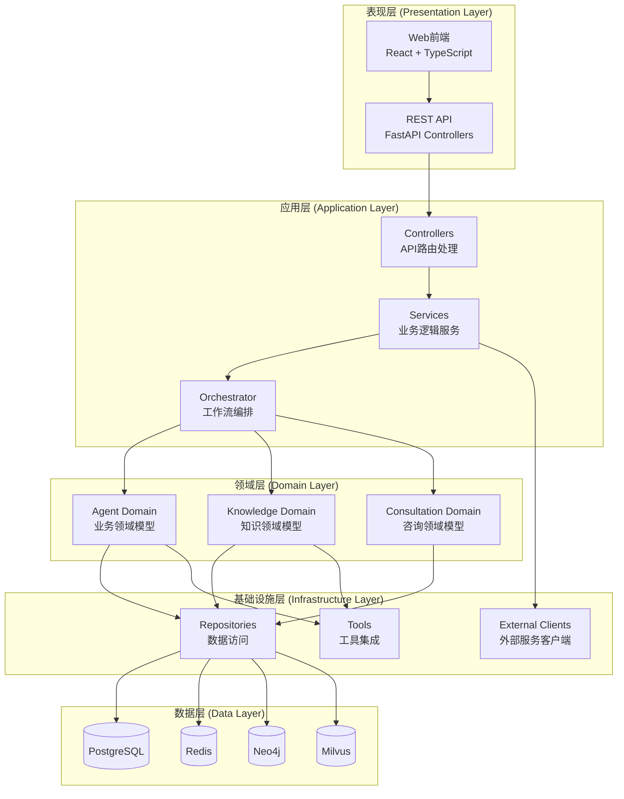
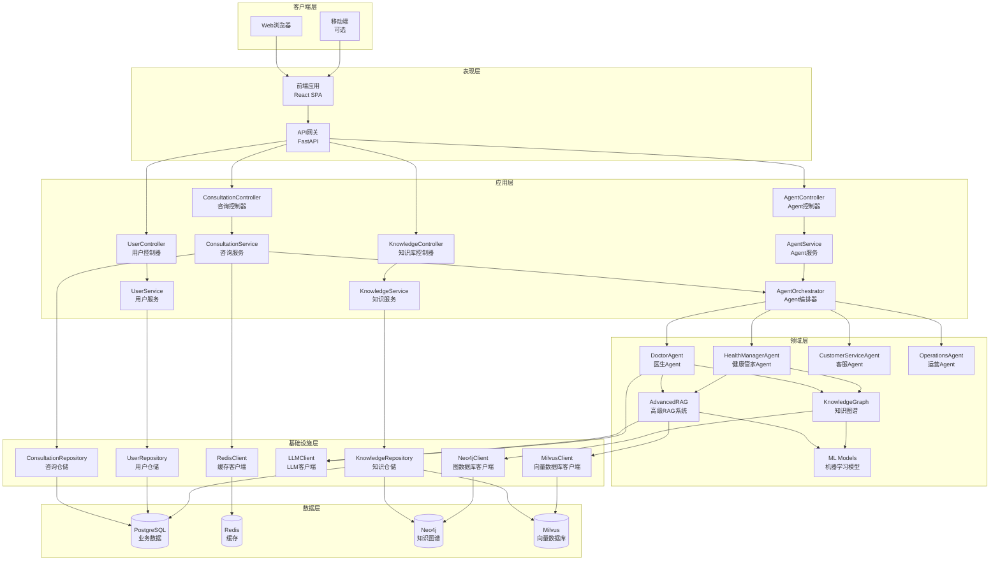
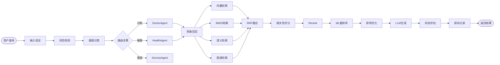

# 智能医疗管家平台 - 系统架构文档

## 架构总览

本系统采用**分层架构（Layered Architecture）**设计，遵循**领域驱动设计（DDD）**原则，使用工业级标准命名规范。

## 系统分层架构



## 详细架构图



## 数据流架构



## 当前目录结构

```
backend/app/
├── api/                    # API层（表现层）
│   └── v1/                 # API版本1
│       ├── consultation.py # 咨询API
│       ├── agents.py       # Agent API
│       ├── knowledge.py    # 知识库API
│       └── users.py        # 用户API
│
├── services/               # 服务层（应用层）
│   ├── llm_service.py      # LLM服务
│   ├── milvus_service.py   # Milvus服务
│   └── redis_service.py    # Redis服务
│
├── agents/                 # Agent层（领域层）
│   ├── doctor_agent.py
│   ├── health_manager_agent.py
│   └── orchestrator.py
│
├── knowledge/              # 知识层（领域层）
│   ├── rag/                # RAG系统
│   ├── graph/              # 知识图谱
│   └── ml/                 # 机器学习
│
├── models/                 # 模型层（领域实体）
│   ├── user.py
│   ├── consultation.py
│   └── knowledge.py
│
├── database/               # 数据库层（基础设施层）
│   ├── session.py
│   └── base.py
│
└── utils/                  # 工具层（通用层）
    ├── logger.py
    └── security.py
```

## 推荐的工业级目录结构

```
backend/app/
├── api/                          # 表现层
│   ├── controllers/              # 控制器
│   │   ├── consultation_controller.py
│   │   ├── agent_controller.py
│   │   ├── knowledge_controller.py
│   │   └── user_controller.py
│   ├── middleware/               # 中间件
│   ├── dto/                      # 数据传输对象
│   └── exceptions/               # 异常定义
│
├── application/                  # 应用层
│   ├── services/                 # 应用服务
│   │   ├── consultation_service.py
│   │   ├── agent_service.py
│   │   └── knowledge_service.py
│   ├── orchestrators/            # 编排器
│   │   └── agent_orchestrator.py
│   └── use_cases/                # 用例
│
├── domain/                       # 领域层
│   ├── agents/                   # Agent领域
│   ├── knowledge/                # 知识领域
│   ├── consultation/             # 咨询领域
│   └── entities/                 # 领域实体
│
├── infrastructure/               # 基础设施层
│   ├── repositories/             # 数据访问
│   ├── external/                 # 外部服务
│   └── database/                 # 数据库配置
│
└── common/                       # 通用层
    ├── logger.py
    └── security.py
```

## 核心组件说明

### 1. 表现层 (Presentation Layer)

**职责**: 处理HTTP请求，参数验证，响应格式化

**组件**:
- **Controllers**: API控制器，处理HTTP请求
- **DTOs**: 数据传输对象，定义请求/响应格式
- **Middleware**: 中间件，处理认证、日志、错误等

**文件位置**: `backend/app/api/controllers/`

### 2. 应用层 (Application Layer)

**职责**: 业务逻辑实现，服务编排

**组件**:
- **Services**: 应用服务，实现业务逻辑
- **Orchestrators**: 编排器，协调多个服务
- **Use Cases**: 用例，封装特定业务场景

**文件位置**: `backend/app/application/`

### 3. 领域层 (Domain Layer)

**职责**: 核心业务逻辑，领域规则

**组件**:
- **Agents**: Agent领域模型
- **Knowledge**: 知识领域模型
- **Entities**: 领域实体

**文件位置**: `backend/app/domain/`

### 4. 基础设施层 (Infrastructure Layer)

**职责**: 技术实现，外部服务集成

**组件**:
- **Repositories**: 数据访问抽象
- **External Clients**: 外部服务客户端
- **Adapters**: 适配器，适配外部系统

**文件位置**: `backend/app/infrastructure/`

### 5. 数据层 (Data Layer)

**职责**: 数据持久化

**存储**:
- PostgreSQL: 业务数据
- Redis: 缓存数据
- Neo4j: 知识图谱
- Milvus: 向量数据

## 命名规范总结

| 层次 | 命名规范 | 示例 |
|-----|---------|------|
| Controller | `*Controller` | `ConsultationController` |
| Service | `*Service` | `ConsultationService` |
| Repository | `*Repository` | `UserRepository` |
| Entity | `*Entity` | `ConsultationEntity` |
| Client | `*Client` | `LLMClient` |
| Agent | `*Agent` | `DoctorAgent` |

## 技术栈映射

| 层次 | 技术栈 |
|-----|--------|
| 表现层 | FastAPI, Pydantic, React |
| 应用层 | Python, LangGraph |
| 领域层 | Python, Domain Models |
| 基础设施层 | SQLAlchemy, Redis, Neo4j, Milvus |
| 数据层 | PostgreSQL, Redis, Neo4j, Milvus |

